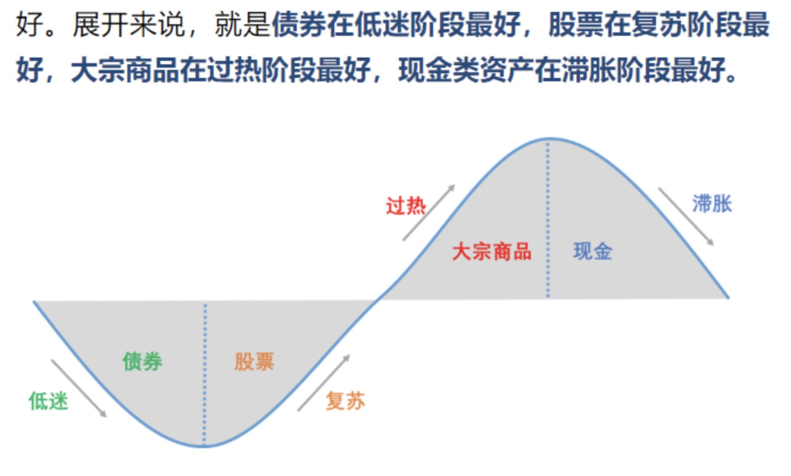

## 投资回报率：三个重要原理

- 稳健原理：不赔钱很重要。
- 几何原理：平均回报是会骗人的。（计算多年回报率的时候，要用几何均值，不用算术均值）
	- 算术平均：回报率累加之后除以年数。
	- 几何平均：回报率累乘之后开方，开发次数等于年数。
- 时间原理：稳健的收益能够长期维持，会创造奇迹。
	- 随着时间变长，基数变大，财富增长变得相对容易。（有钱人容易挣钱）
	- 对于长期稳健增长的力量，我们往往是低估的。

## 投资决策的三个基本问题
> 买什么？这是投资工具的问题，回答购买什么资产。
> 
> 买多少？这是投资组合的问题，回答如何分配资金在各种资产上，构建自己的投资组合。
> 
> 何时买？这是投资时机的问题，回答什么时候买，什么时候卖的问题。

### 买什么？投资工具
大类资产  | 细分资产
------------- | -------------
现金  | 存款、货币基金（余额宝、零钱通等）
债券  | 国债、金融债、企业债、公司债、理财产品、债券基金
股票  | A股、港股、美股、普通股、优先股、股票基金
外汇  | 美元、欧元、日元、英镑
金融衍生品  | 期权、期货、涡轮、牛熊证、分级B基金
商品期货  | 能源（石油、天然气）、金属（黄金、白银、铜、铝）、农产品（大豆、小麦、玉米、鸡蛋）
房地产  | 普通住宅、商业住宅、商铺
另类投资  | 古董、字画、砖石、众筹

投资的第一步，是准确、深入认识这些投资工具。

挑选投资工具的原则

- 投资是做自己懂得事情，不懂的产品不要碰。（投资最重要的事情是不赔钱，少赔钱）
- 对于投资的每一个产品，都要搞清两个基本属性 安全性+流动性

根据安全性，把资产分为安全性和风险资产。现实中，大部分资产都是风险资产，比如：股票、债券、基金、房产都是风险资产。只有少部分资产是安全资产，例如：存款，货币基金，国库券（严格来讲，这些资产也是有风险的，是通货膨胀风险）

流动性，是指变现的时间，变现的时间越短，流动性越好。

根据安全性和流动性这两个基本属性，把资产分为三类

性质  | 代表性资产
------------- | -------------
无风险、流动性高 | 存款、货币基金、国债
有风险、流动性高 | 股票、基金、公司债券、期权、期货
有风险、流动性低 | 房子、古董、字画、钻石

### 买多少？投资组合
> 合理分配资金，形成你的投资组合，是一个统筹考虑，全盘布局的概念。

买股票买多少的问题，不是说你在一只股票上投资了多少钱，而是在这只股票上配置多少资金，指的是这只股票在你的投资组合中的占比。在一个资产上不要配置太多资金。

在单个资产上下大赌注，容易导致回报率大起大落，长期回报率反而不高。统筹决策，构建稳健的投资组合，实现长期的收益。

投资组合三大目标
- 保持流动性 配置足够的现金类资产，保持流动性。
- 分散风险  分散风险的准确表达，不是不承担风险，而是不承担不必要的风险
- 优化收益  在保持流动性的前提下，把资产稳妥配置在较高收益的资产上，有助于提高长期收益

### 何时买？投资择时

基本理论：“美林时钟”理论，根据经济学原理和历史经验，把资金在大类资产中间进行轮换配置，预计哪一类资产涨，就开始配置这一类资产。

这个理论把资产分为4类，分别是债券，股票，大宗商品，现金。

经济运行也分为四个阶段，低迷（刺激），复苏，过热（紧缩），滞涨

第一阶段，低迷阶段。这时候的经济政策，大概率是要刺激的，怎么刺激，就是增加货币发行，印钞票。

第二阶段，刺激一段时间后，企业的经营情况开始改善，所以这个时候股票最好。

第三阶段，通胀开始起来，物价水平开始普遍上涨，这个时候大宗商品的价格涨幅最快。

第四阶段，通货膨胀起来了，政府就不能坐视不管，就要宏观调控。1) 宏观紧缩，债券肯定不能买了，货币政策紧了，票子少了，首先就影响债券，债券价格有可能下跌。2) 经济滞胀，股票也不能买了，这时候经济增速下行，上市公司利润增速下降，而且通胀上升，成本上涨，会加剧利润下滑。加上前期股票可能涨速过快，透支了利润增长，股票可能开始回调。3) 大宗商品风险较大，因为政策收缩，很多需求很快就没了，大宗商品价格也面临下行风险。

